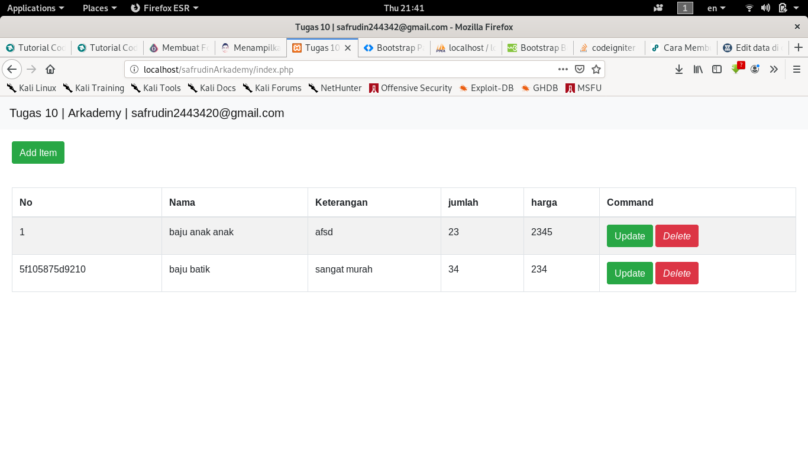
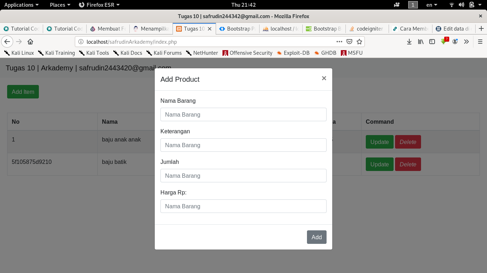
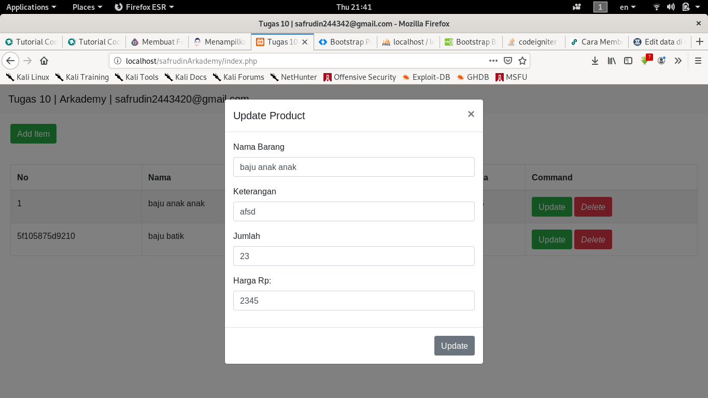
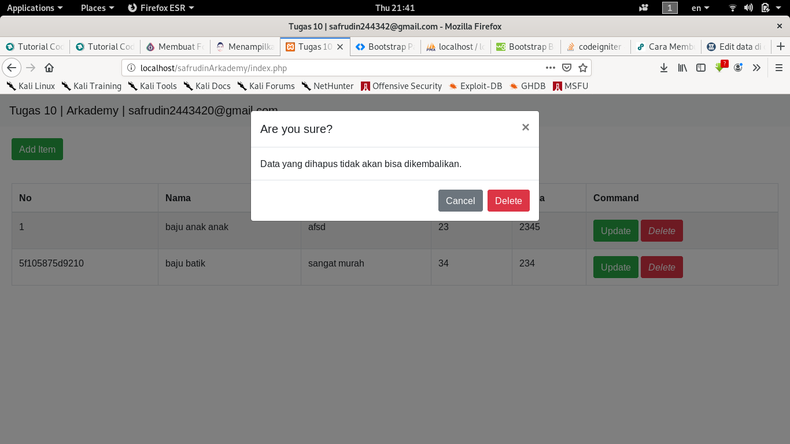

# safrudinArkademy

# tampilan awal website

**1. Homa Page**


**2. Page Add Item**


**3. Page Update Item**


**4. Page Delete Item**


# table yang saya gunakan berisi 5 kolom
1. id > berisi produk id
2. nama_produk > berisi nama produk
3. keterangan > berisi keterangan produk
4. harga > berisi harga produk
5. jumlah > berisi jumlah produk

# framework yang digunakan
1. codeigniter
2. bootstrap

# Perubahan code penting

**1. Jika akan menggunakan di server atau pc lain**

Harap merubah code di file application/config/config.php line 26
```bash
$config['base_url'] = 'http://localhost/safrudinArkademy';
```

ganti ```http://localhost/safrudinArkademy``` dengan alamat website yang akan kalian gunakan

**2. Jika ingin mengganti database**

Harap merubah code di file application/config/database.php line 76 - 96
```bash
$db['default'] = array(
	'dsn'	=> '',
	'hostname' => 'localhost',
	'username' => 'root',
	'password' => '',
	'database' => 'arkademy',
	'dbdriver' => 'mysqli',
	'dbprefix' => '',
	'pconnect' => FALSE,
	'db_debug' => (ENVIRONMENT !== 'production'),
	'cache_on' => FALSE,
	'cachedir' => '',
	'char_set' => 'utf8',
	'dbcollat' => 'utf8_general_ci',
	'swap_pre' => '',
	'encrypt' => FALSE,
	'compress' => FALSE,
	'stricton' => FALSE,
	'failover' => array(),
	'save_queries' => TRUE
);
```
Yang perlu kalian rubah hanya ``` 'hostname' => 'localhost' ``` ganti dengan alamat database anda, ``` 'username' => 'root',``` 
ganti dengan username database anda, ``` 'password' => '', ``` ganti dengan password database anda, ``` 'database' => 'arkademy', ```
 Ganti dengan nama database anda
